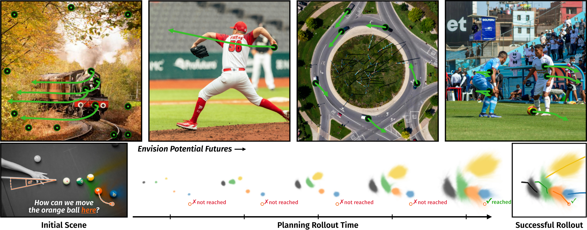

# Flow Poke Transformer & MYRIAD

<h2 align="center">Envisioning the Future, One Step at a Time</h2>

[](https://compvis.github.io/myriad)
[](_blank)
[](https://huggingface.co/CompVis/myriad)
[](https://huggingface.co/datasets/CompVis/owm-95)

<div align="center">
  <a href="https://stefan-baumann.eu/" target="_blank">Stefan A. Baumann</a><sup>*,1,2</sup> · 
  <a href="" target="_blank">Jannik Wiese</a><sup>*,1,2</sup> · 
  <a href="" target="_blank">Tommaso Martorella</a><sup>1,2</sup> · 
  <a href="" target="_blank">Mahdi M. Kalayeh</a><sup>3</sup> · 
  <a href="https://ommer-lab.com/people/ommer/" target="_blank">Björn Ommer</a><sup>1,2</sup>
</div>
<p align="center"> 
  <b><sup>1,2</sup>CompVis @ LMU Munich, MCML, <sup>3</sup>Netflix</b><br/>CVPR 2026
</p>



From a single image MYRIAD predicts distributions over sparse point trajectories autoregressively. This allows us to predict physically consistent futures in open-set environments (top) conditioned on input movements. By exploring directly in motion space, we can rapidly explore thousands of counterfactual futures, enabling planning by search - here to select a billiard shot (bottom).

This codebase contains PyTorch implementations for training & evaluation.

<h2 align="center"><i>What If:</i> Understanding Motion Through Sparse Interactions</h2>

[](https://compvis.github.io/flow-poke-transformer/)
[](https://arxiv.org/abs/2510.12777)
[](https://huggingface.co/CompVis/flow-poke-transformer)

<div align="center"> 
  <a href="https://stefan-baumann.eu/" target="_blank">Stefan A. Baumann</a><sup>*</sup> · 
  <a href="https://nickstracke.dev/" target="_blank">Nick Stracke</a><sup>*</sup> · 
  <a href="" target="_blank">Timy Phan</a><sup>*</sup> · 
  <a href="https://ommer-lab.com/people/ommer/" target="_blank">Björn Ommer</a>
</div>
<p align="center"> 
  <b>CompVis @ LMU Munich, MCML</b><br/>ICCV 2025
</p>


Flow Poke Transformer (FPT) directly models the uncertainty of the world by predicting distributions of how objects (<span style="color:#ff7f0e">×</span>) may move conditioned on some input movements (pokes, →). We see that whether the hand (below paw) or the paw (above hand) moves downwards directly influences the other's movement. Left: the paw pushing the hand down, will force the hand downwards, resulting in a unimodal distribution. Right: the hand moving down results in two modes, the paw following along or staying put.

This codebase containts a minimal PyTorch implementation covering training & various inference settings.

# 🚀 Usage
The easiest way to try FPT is via our interactive demo, which you can launch as:
```shell
python -m scripts.demo.app --compile True --warmup_compiled_paths True
```
Compilation is optional, but recommended for a better time using the UI. A checkpoint will be downloaded from huggingface by default if not explicitly specified via the CLI.

When using our models yourself, the simplest way to use it is via `torch.hub`:
```python
fpt = torch.hub.load("CompVis/flow_poke_transformer", "fpt_base")

myriad_openset = torch.hub.load("CompVis/myriad", "myriad_openset")

myriad_billiard = torch.hub.load("CompVis/myriad", "myriad_billiard")
```

If you want to completely integrate FPT into your own codebase, copy `model.py` and `dinov2.py` from `flow_poke/` to your codebase and you should effectively be good to go. Then instantiate the model as
```python
model: FlowPokeTransformer = FlowPokeTransformer_Base()
state_dict = torch.load("fpt_base.pt")
model.load_state_dict(state_dict)
model.requires_grad_(False)
model.eval()
```

The `FlowPokeTransformer` class contains all the methods that you should need to use FPT in various applications. For high-level usage, use the `FlowPokeTransformer.predict_*()` methods. For low-level usage, the module's `forward()` can be used.

Similarly, you can copy `model.py` and `dinov3.py` from `myriad/` to your codebase and instantiate the model as
```python
model: MyriadStepByStep = MyriadStepByStep_Large()
state_dict = torch.load("myriad_openset.pt")
model.load_state_dict(state_dict)
model.requires_grad_(False)
model.eval()
```

You can use the `predict_simulate` method form `MyriadStepByStep` for unrolling trajectories or the `forward` to obtain a distribution for the current step.

The only dependencies you should need are a recent `torch` (to enable flex attention, although it would be plausible to patch it out with some effort to enable usage of lower torch version), and any `einops`, `tqdm`, and `jaxtyping` (dependency can be removed by deleting type hints) versions. Using DINOv3 additionally requires `transformers` to be installed.

# About the Codebase
Code files are separated into major blocks with extensive comments explaining relevant choices, details, and conventions.
For all public-facing APIs involving tensors, type hints with [`jaxtyping`](https://github.com/patrick-kidger/jaxtyping) are provided, which might look like this: `img: Float[torch.Tensor, "b c h w"]`. They annotate the dtype (`Float`), tensor type `torch.Tensor`, and shape `b c h w`, and should (hopefully) make the code fully self-explanatory.

**Coordinate & Image Conventions.**
We represent coordinates in (x, y) order with image coordinates normalized in $[0, 1]^2$ (the outer bounds of the image are defined to be 0 and 1 and coordinates are assigned based on pixel centers).
Flow is in the same coordinate system, resulting in $[-1, 1]^2$ flow.
Pixel values are normalized to $[-1, 1]$.
See the `Attention & RoPE Utilities` section in [`model.py`](flow_poke/model.py) for further details


# 🔧 Training

**Data Preprocessing.**
For data preprocessing instructions, please refer to the [corresponding readme](scripts/data/README.md).

**Launching Training.**
Single-GPU training can be launched via
```shell
python train.py [fpt | myriad | billiards] --tar_base /path/to/preprocessed/shards --out_dir output/test --compile True
```
Similarly, multi-GPU training, e.g., on 2 GPUs, can be launched using torchrun:
```shell
torchrun --nnodes 1 --nproc-per-node 2 train.py [...]
```
Training can be continued from a previous checkpoint by specifying, e.g., `--load_checkpoint output/test/checkpoints/checkpoint_0100000.pt`.
Remove `--compile True` for significantly faster startup time at the cost of slower training & significantly increased VRAM usage.

For a full list of available arguments, refer to [`train.py`](train.py). We use [`click`](https://click.palletsprojects.com/en/stable/), such that every argument to the main train function is directly available as a CLI argument.

# 💽 OWM

Preprocessed videos, metadata, and tracker annotations obtained using [TapNext](https://github.com/google-deepmind/tapnet) for the OWM benchmark are [available on huggingface](https://huggingface.co/datasets/CompVis/owm-95). You can easily run the OWM benchmark by running
```shell
python -m scripts.myriad_eval.openset_prediction --data-root path/to/data  --ckpt-path path/to/checkpoint --dataset-name [owm | physion | physics-iq]
```

The metadata in `annotations.json` contains additional information further describing the observed motion. For example we annotate the type of motion (e.g. rigid- or non-rigid-body physics), the number of actors with free will, and whether physical interactions between object occur. The annotations further include `polygons` that describe the area of the image where actors cannot move if motion is constrained.

**Further Evaluation from MYRIAD**

We additionally include code for our billiard planning-by-search evaluation in `scripts/myriad_eval/billiard_planning.py` from the MYRIAD paper. Further, `scripts/myriad_eval/qual.py` includes code to produce qualitative examples for trajectories sampled auto-regressively with our openset MYRIAD model.

# License
We release the weights of our open-set model via huggingface at https://huggingface.co/CompVis (under the [CC BY-NC 4.0](https://creativecommons.org/licenses/by-nc/4.0/deed.en) license), and will potentially release further variants (scaled up or with other improvements).
Due to [copyright concerns surrounding the WebVid dataset](https://github.com/m-bain/webvid?tab=readme-ov-file#dataset-no-longer-available-but-you-can-still-use-it-for-internal-non-commerical-purposes), will not distribute the model weights for the FPT model trained on it. Both models perform approximately equally (see Tab. 1 in the paper), although this will vary on a case-by-case basis due to the different training data.

Videos in the OWM benchmark are released under the [Pexels License](https://www.pexels.com/license/), we release annotations under the under the [CC BY-NC-SA 4.0](https://creativecommons.org/licenses/by-nc-sa/4.0/deed.en) license.

# Code Credit
- Some model code is adapted from [k-diffusion](https://github.com/crowsonkb/k-diffusion) by Katherine Crowson (MIT)
- The DINOv2 code is adapted from [minDinoV2](https://github.com/cloneofsimo/minDinoV2) by Simo Ryu, which is in turn adapted from the [official implementation](https://github.com/facebookresearch/dinov2/) by Oquab et al. (Apache 2.0)

# 🎓 Citation
If you find our model or code useful, please cite our papers:
```bibtex
@inproceedings{baumann2025whatif,
    title={What If: Understanding Motion Through Sparse Interactions}, 
    author={Stefan Andreas Baumann and Nick Stracke and Timy Phan and Bj{\"o}rn Ommer},
    booktitle={Proceedings of the IEEE/CVF International Conference on Computer Vision (ICCV)},
    year={2025}
}
```

```bibtex
@inproceedings{baumann2026envisioning,
  title={Envisioning the Future, One Step at a Time},
  author={Baumann, Stefan Andreas and Wiese, Jannik and Martorella, Tommaso and Kalayeh, Mahdi M. and Ommer, Bjorn},
  booktitle={Proceedings of the IEEE/CVF Conference on Computer Vision and Pattern Recognition (CVPR)},
  year={2026}
}
```
